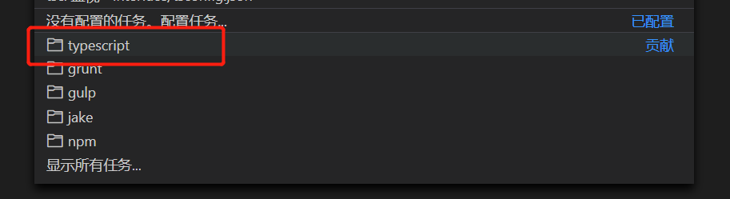
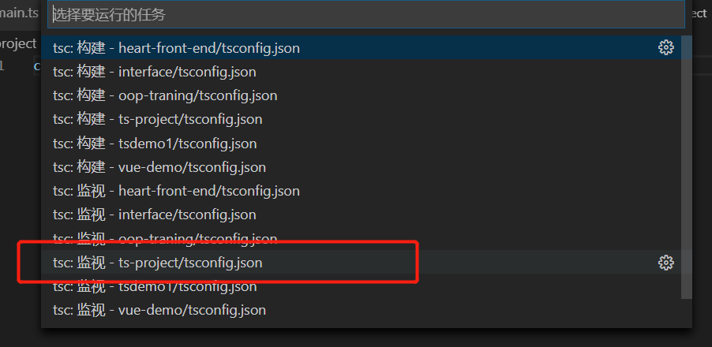
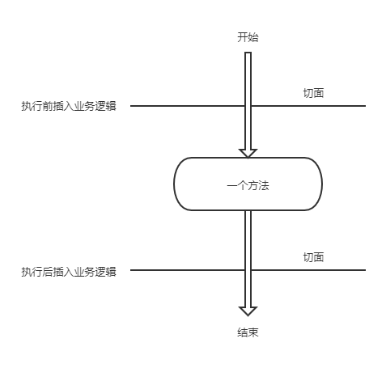
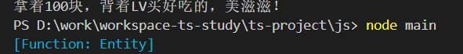

# TypeScript

## 看看以前的代码

这是一个main.js文件，里面有一些函数

```js
function init() {
    console.log("各种初始化操作");
}

function compute() {
    console.log("各种逻辑运算");
}

function domHandle() {
    console.log("各种dom操作");
}
```

如果我们需要使用这些函数来完成一定的操作，我们会这样

```js
(function(){
    init();
    compute();
    domHandle();
})();
```

如果现在又有一个两个业务，需要用到main.js里面的函数，但是两个业务对于comput函数又有不同的实现要求，而且两个业务各自还有一些另外的业务需求，这时我们可以选择修改main.js

```js
function init() {
    console.log("各种初始化操作");
}

function compute() {
    console.log("各种逻辑运算");
}

function domHandle() {
    console.log("各种dom操作");
}

function compute1() {
    console.log("业务1的各种逻辑运输");
}

function compute2() {
    console.log("业务2的各种逻辑运输");
}

function other1() {
    console.log("业务1另外的业务需求");
}

function other2() {
    console.log("业务2另外的业务需求");
}
```

然后两个业务各自引入main.js完成自己的工作

* 业务1

```js
(function(){
    init();
    compute1();
    domHandle();
    other1();
})();
```

* 业务2

```js
(function(){
    init();
    compute2();
    domHandle();
    other2();
})();
```

> 如果我们还想添加或者修改业务，可能会不断修改main.js，当业务逻辑相对复杂的时候，这样的修改可能会产生出新的bug，并且影响原来本来没有问题的代码，维护成本就会变高，扩展性不好

上面这样的代码叫做**面向过程编程**，这样的编程方式是以前前端经常使用的，原因是JavaScript的设计更加倾向于面向过程的思想，虽然有new运算，但是实际上对于面向对象编程的支持并不好

> **面向过程编程**的优点在于编写小项目时，直接明了，没有过多的封装和层层调用，效率也高
> 但是现在随着前端工程化的趋势，前端承担了更多的业务逻辑实现，逐渐变成一个比较庞大而复杂的项目
> 在这样的背景下，面向过程编程的缺点就凸显出来了
> 前端也需要能够很好的支持面向对象的语言，来应对大项目的开发，**TypeScript**应运而生

## 了解TypeScript
### 概述

**TypeScript**是由**微软**开发的语言，的作者是**C#**的首席架构师**安德斯·海尔斯伯格**，首个版本发布于2012年10月，目前最新版本是3.9。TypeScript其实是JavaScript的超集，或者说是加强版。支持所有的Javascript语法，并在此之上添加了严格的**类型**检测，以及**面向对象思想**。编写好的TypeScript代码，会被编译器编译成JavaScript来运行

> TypeScript发布之后，同时也得到了**谷歌**大力推广，现在主流的前端框架，**Angular JS**、**Vue**、**React**的底层代码都使用TypeScript编写，可以说TypeScript就是大前端时代的未来

### 安装TypeScript

npm：

```cmd
npm install -g typescript
```

yarn：

```cmd
yarn global add typescript
```
### 创建TypeScript项目

1. 创建文件夹ts-project
2. 初始化ts-project

```cmd
cd .\ts-project\
tsc --init
```
> 执行上面命令后，ts-project文件夹下会生成tsconfig.json文件，表示初始化成功

### 运行TypeScript项目

> 推荐使用VS Code开发

1. 修改tsconfig.json中的outDir项
```json
"outDir": "./js"
```

2. 在ts-project新建main.ts文件，写个hello world
```ts
console.log("hello world");
```


3. 点击VS Code工具栏的终端->运行任务->typescript



4. 然后这样



> 操作之后项目会自动生成js文件夹，并且里面会有一个main.js文件，这个就是编译器编译好的js

5. 进入js文件夹，用node命令运行main.js

```cmd
cd .\js\
node main

# 输出结果
> hello world
```

### TypeScript目前支持的基本类型

| 类型 | 描述 |
| --- | --- |
| number | 数字类型 |
| string | 字符串类型 |
| boolean | 布尔类型，true或者false |
| object | 对象类型 |
| null | 空值类型，表示变量的值是一个空值 |
| undefined | 未定义类型，表示变量的值是undefinded |
| unknown | 未知类型，表示变量在定义的时候，还不知道会是什么类型 |
| never | 表示变量是从不执行的代码，一边在switch的default里面使用，检查是否所有分支都已经处理 |
| any | 与unknown相似，但是如果使用了any类型，则等于放弃了类型检查，变量可以任意赋值和调用任意方法，一般情况下不建议使用any，经常有人调侃TypeScript=AnyScript，就是说随便使用any类型，还不如用JavaScript |

### 使用类型定义变量

JavaScript的写法：

```js
let a = 123;
let b = "abc";

// 这样随便赋值都不会有问题
let c = a;
c = b;
```

TypeScript的写法：

```ts
let a: number = 123;
let b: string = "abc";

let c = a;
// 因为c被a赋值，编译器认为c就是number类型，所以下面一行会报类型不匹配的错误
c = b;
```

> 在定义变量时，都遵守声明清楚类型的规范

```ts
// 不规范
let a = 123;
let b = a;
 
// 规范
let a: number = 123;
let b: number = a;
```

> unknown和any的区别，unknown变量只能赋值给unknown变量和any变量，any变量可以赋值给任何变量，任何变量都可以赋值给unknown变量和any变量

```ts
/* unknown变量赋值 */
let n: number = 123;
// 编译通过
let a: unknown = n;
let b: unknown = a;
let c: any = a;
// 编译不通过
let d: number = a;

/* any变量赋值 */
let n: number = 123;
// 编译通过
let a: any = n;
let b: unknown = a;
let c: any = a;
let d: number = a;
```

### 函数定义
函数定义与JavaScript相比，只是对了对于参数和返回值的类型声明
```ts
function main(): void {
    console.log("hello world");
}

function getString(str: string): string {
    return str;
}

main();
console.log(getString("hello world"));
```

### 枚举

JavaScript并没有枚举类型，但是Java、C++等高级语言都有，TypeScript将其引入，可以用来定义一组有关系的常量或者作为判断条件

```ts
// 第一种，不赋值，枚举的值就是下标值，即NOODLES = 0，RICE = 1，DOUFU = 2
enum Food {
    NOODLES,RICE,DOUFU
}

// 第二种，赋值，枚举的值就是给定的值
enum Food {
    NOODLES = 1,RICE = 2,DOUFU = 3
}
```

枚举使用

```ts
function foodHandle(food: Food): void {
    switch (food) {
        case Food.NOODLES:
            console.log("吃面");
            break;
        case Food.RICE:
            console.log("吃饭");
            break;
        case Food.DOUFU:
            console.log("吃豆腐");
            break;
        default:
            exceptionHandle(food);
            break;
    }
}

// 这里顺便演示了never的用法，纯粹说明也不直观
function exceptionHandle(food: never): void {
    console.log("这种食物没见过！！？？？");
    throw new Error("这种食物没见过！！？？？");
}

let food: Food = Food.DOUFU;

foodHandle(food);
```

### 命名空间
命名空间是为了在大型项目中，避免多个类的情况重名，不过感觉TypeScript的命名空间不是很好使，主要是多个文件使用同一个命名空间的时候经常会出问题。

```ts
// namespace关键字定义命名空间，命名空间内的成员必须要export才能被命名空间外的代码使用
namespace example {
    export enum Food {
        NOODLES = 1,RICE = 2,DOUFU = 3
    }
    
    export function foodHandle(food: Food): void {
        switch (food) {
            case Food.NOODLES:
                console.log("吃面");
                break;
            case Food.RICE:
                console.log("吃饭");
                break;
            case Food.DOUFU:
                console.log("吃豆腐");
                break;
            default:
                exceptionHandle(food);
                break;
        }
    }

    function exceptionHandle(food: never): void {
        console.log("这种食物没见过！！？？？");
        throw new Error("这种食物没见过！！？？？");
    }
}

// 调用时加上定义的命名空间前缀
let food: example.Food = example.Food.DOUFU;

example.foodHandle(food);
```

### ?和!修饰符

假如一个函数定义了4个参数，但是很多情况下只会传入第1个参数，后面三个参数可能不会被传入，即可选参数，这种情况我们我可在可选参数上添加?修饰符

```ts
// bag是可选参数
function buyFood(money: number, bag?: string) {
    console.log("买吃的不一定要带包，有钱就行");
}

buyFood(100);
```

!修饰符的用法，先看一段不规范的代码
```ts
let money: number;

// 下面的代码会报错的，因为money没有赋值，TypeScript认为这个值会是undefined
buyFood(money);
```

如果很确定monye一定不会是undefined，可以郑重其事地告诉编译器

```ts
// 加上!修饰符，告诉编译器一定不会是undefined
let money!: number;

// 下面的代码编译就不会报错了
buyFood(money);
// 为了举例子写的极端代码，实际工作当中千万不要模仿-_-
```

### 函数参数默认值
函数定义参数时可以给参数赋默认值，这样调用函数的时候可以不需要传参数，使用默认值

```ts
function buyFood(money: number = 100, bag: string = "LV包") {
    console.log(`拿着${money}块，背着${bag}买好吃的，美滋滋！`);
}

buyFood();
```

> 以上就是TypeScriopt的基本语法，当然，这还不包括面向对象的特性

## 面向对象编程和TypeScript
### 面向对象思想

对于一些前端工程师来说，**面向对象编程**（OOP）可能会有些陌生，世间万物皆对象，每一个对象都会有自己的属性和行为，比如楼下的喵星人，它有身高、体重、性别这些属性，有吃饭、睡觉和捉老数这些行为，而面向对象编程就是把这些实实在在的对象抽象成逻辑模型，用代码去展现它们的行为。

通过了解面向对象编程的思想，我们逐渐可以体会到灵活和扩展性强的好处

面向对象编程有一些基本概念

| 概念 | 说明 |
| --- | --- |
| 类 | 事务的类别，比如人、动物、猫这要表示一个群体的种类 |
| 对象 | 通过类实例化出来的一个个实在的个体，比如张三、旺财、hellokitty |
| 成员变量 | 可以理解为类的属性 |
| 成员方法 | 可以理解为类的行为 |
| 继承 | 一个类可以继承另外一个类，获得其属性和方法，比如猫这个类就是继承了动物的类，猫具有动物的所有共同属性和方法 |
| 多态 | 同一段代码，可以呈现出不同的效果 |
| 封装 | 将成员变量封装起来，不允许外部访问，如果要访问或修改成员变量，则通过暴露的方法来间接访问 |

光讲上面这些应该比较难理解吧，下面先讲一个动物开演唱会的故事来抛砖引玉

首先定义两个**类**：猫和狗，TypeScript用class关键字来定义类

```ts
// 类的首字母大写

// 猫
class Cat {

    name: string;

    // 每个类都要有一个构造函数，如果不写，则默认定义一个没有参数，空实现的构造函数
    constructor(name: string) {
        this.name = name;
    }

    叫(): void {
        console.log(`${this.name}在叫：喵~`);
    }

}

// 狗
class Dog {
    name: string;

    constructor(name: string) {
        this.name = name;
    }

    叫(): void {
        console.log(`${this.name}在叫：汪汪！`);
    }

}

```

通过new关键字实例化类，形成**对象**，实例化的时候会调用自动构造函数

```ts
// 实例化
let dog: Dog = new Dog("旺财");
let cat: Cat = new Cat("花花");

// 让它们叫一下
dog.叫();
cat.叫();
```

#### 继承

以上是最简单的面向对象编程，new一下就好了，不过我们发现猫也会叫，狗也会叫，其实很多动物都会叫，我们可以把这些公共的方法**抽象**成一个上级的动物类，猫、狗都**继承**这个动物类，然后各自实现自己叫方法，发出自己的声音

```ts
// 动物是一个抽象的概念，所以用抽象类来定义
// 定义抽象类使用abstract关键字
abstract class Animal {
    // 需要子类实现得方法是抽象方法，需要用abstract关键字标记
    abstract 叫(): void;
}

// 类得继承使用extends关键字
class Cat extends Animal {

    name: string;

    constructor(name: string) {
        // 构造函数需要先调用父类得构造函数，然后再执行本类得逻辑
        super();
        this.name = name;
    }

    // 继承的抽象方法，每个子类都有自己的实现
    叫(): void {
        console.log(`${this.name}在叫：喵~`);
    }

}

class Dog extends Animal {
    name: string;

    constructor(name: string) {
        super();
        this.name = name;
    }

    叫(): void {
        console.log(`${this.name}在叫：汪汪！`);
    }

}

// 子类的类型可以赋值给父类的类型
let dog: Animal = new Dog("旺财");
let cat: Animal = new Cat("花花");

dog.叫();
cat.叫();
```

> 上面就是面向对象编程的**继承**特性
> 注意，每个类只能继承一个类，这就是**单继承**规则

#### 多态

我们来看看这样的业务场景，加入现在要举办动物演唱会，我们需要一个舞台，动物依次上台，台上的动物都会发出自己独特而美妙的叫声，看看怎么实现呢

首先我们需要一个舞台，里面有一个演唱会的方法，需要有动物上台，所以接收一个动物对象，演唱会方法里面调用动物的叫方法，让动物发出声音

```ts
class 舞台 {
    演唱会(动物: Animal): void {
        动物.叫();
    }
}
```

我们可以实例化舞台和动物，让动物一个个上台唱歌就可以啦

```ts
let stage: 舞台 = new 舞台();
let dog: Animal = new Dog("旺财");
let cat: Animal = new Cat("花花");

stage.演唱会(dog);
stage.演唱会(cat);
```

> 我们可以看到舞台类的演唱会方法的代码是一样的，但是传入的动物不一样，所展现的效果也就不一样了，这个就是面向对象编程的**多态**特性

#### 封装

在面向对象的规范中，会将成员变量隐藏起来，不让外部的代码直接访问，如果需要操作成员变量，则需要通过暴露的方法来间接操作，这就是面向对象编程的**封装**特性

上面定义的猫和狗两个类，我们可以用过对象直接访问name成员变量，这显然不符合面向对象编程的思想

```ts
let dog: Dog = new Dog("旺财");
let cat: Cat = new Cat("花花");

dog.name = "boby"
console.log(dog.name); //输出"boby"

cat.name = "Kitty";
console.log(cat.name); //输出"Kitty"
```

所以我们要讲这两个类改造一下

```ts
class Cat extends Animal {

    // 添加了private关键字
    private name: string;

    constructor(name: string) {
        super();
        this.name = name;
    }

    叫(): void {
        console.log(`${this.name}在叫：喵~`);
    }

    // 添加了set和get访问器
    set setName(name: string) {
        this.name = name;
    }

    get getName(): string {
        return this.name;
    }
}

class Dog extends Animal {
    private name: string;

    constructor(name: string) {
        super();
        this.name = name;
    }

    叫(): void {
        console.log(`${this.name}在叫：汪汪！`);
    }

    set setName(name: string) {
        this.name = name;
    }

    get getName(): string {
        return this.name;
    }

}

let dog: Dog = new Dog("旺财");
let cat: Cat = new Cat("花花");

dog.setName = "boby";
console.log(dog.getName);
cat.setName = "kitty";
console.log(cat.getName);
```

上面代码中用到了JS的访问器，不知道的请自行百度

在类的name成员变量前面添加了private关键字，代表设置了这个成员变量的访问权限。
成员变量和成员方法都可以设置访问权限的，访问权限控制关键字有以下几种：

| 关键字 | 说明 |
| --- | --- |
| public | 公共成员，类以外的所有地方都可以访问 |
| protected | 受保护成员，只有本类以及其子类才能访问 |
| private | 私有成员，只有本类可以访问 |

#### 静态成员和动态成员

面向对象编程中，成员可以分成静态成员和动态成员
+ 静态成员即不需要实例化成对象就可以访问的成员
+ 动态成员即需要实例化成对象之后才能访问的成员

静态成员需要用static关键字标记，没有标记的都是动态成员

```ts
class Dog extends Animal {
    static kind: string = "汪星人";

    private name: string;

    constructor(name: string) {
        super();
        this.name = name;
    }

    叫(): void {
        console.log(`${this.name}在叫：汪汪！`);
    }

    set setName(name: string) {
        this.name = name;
    }

    get getName(): string {
        // 动态成员则可以访问静态成员
        return `${this.name}是${Dog.kind}`;
    }
    
    static sleep(): void {
        // 静态成员只能调用静态成员
        console.log(`${Dog.kind}都会睡觉`);
    }

}

// 静态成员不需要实例化就可以调用
console.log(Dog.kind);
Dog.sleep();
```

#### 泛型

泛型的概念有点抽象，就是当处理业务逻辑是，还不能确定处理的对象是什么类型，可以定义一个类型标志，代表传入的是什么类型就是什么类型

我们还是举个例子吧，比如有一个手机代工厂，客户给什么要的手机样板，就生产什么手机出来

```ts
// 定义泛型T
class PhoneFactory<T> {

    // 传入的参数和返回值都是给定的类型
    produce(template: T): T {
        return template;
    }

}

class IPhone {
    private name: string = "IPhone 12";

    get getName(): string {
        return this.name;
    }
}

class Huawei {
    private name: string = "HUAWEI MATE 40";

    get getName(): string {
        return this.name;
    }
}

// 设置泛型为IPhone类型
let iphoneFactory: PhoneFactory<IPhone> = new PhoneFactory();
let iPhone: IPhone = new IPhone();
// 返回也是IPhone类型
let phone1: IPhone = iphoneFactory.produce(iPhone);
console.log(phone1.getName);

// 设置泛型为Huawei类型
let huaweiFactory: PhoneFactory<Huawei> = new PhoneFactory();
let huaweiPhone: Huawei = new Huawei();
// 返回也是Huawei类型
let phone2: Huawei = huaweiFactory.produce(huaweiPhone);
console.log(phone2.getName);
```

### 接口

接口可以说是定义一个规范，让所有相关的业务都按照这个规范来实现

TypeScript中的接口中，用得比较多的是属性接口、方法接口和实现接口，接口使用interface关键字来定义

#### 属性接口

属性接口是只包含属性的接口，一般用来控制传参的规范

```ts
// 属性接口
interface Student {
    name: string,
    age: number,
    sex: string
}

class School {
    addStudent(student: Student): void {
        console.log(`学生${student.name}入学`);
    }
}

let school: School = new School();
// 下面的代码编译不通过，因为传入的参数不符合Student属性接口
school.addStudent({
    name: "小明"
});

// 编译通过
school.addStudent({
    name: "小明",
    age: 8,
    sex: "男"
});
```

#### 方法接口

定义一个方法的规范，使用得相对比较少，了解一下

```ts
// 方法接口
interface addition {
    (a: number, b: number): number;
}

// 实现方法
// 参数和返回值类型都必须遵循addition接口
let fn: addition = function(a:number, b: number) {
    return a + b;
}
```

#### 实现接口

定义一个类的属性和方法规范，可以理解成特殊的抽象类，实际项目中使用得非常多

```ts
// 实现接口
interface Animal {
    name: string;
    叫(): void;
    睡觉(): void;
}

// 实现接口使用implements关键字
class Cat implements Animal {
    name: string;
    constructor(name: string) {
        this.name = name;
    }
    叫(): void {
        console.log(`${this.name}在叫：喵~`);
    }
    睡觉(): void {
        console.log(`${this.name}不喜欢睡觉`);
    }

}

class Dog implements Animal {
    name: string;
    constructor(name: string) {
        this.name = name;
    }
    叫(): void {
        console.log(`${this.name}在叫：汪汪！`);
    }
    睡觉(): void {
        console.log(`${this.name}在睡觉`);
    }

}
```

> 使用实现接口方式同样可以实现**多态**

#### 抽象类和实现接口的区别

抽象类和实现接口的区别在与两点：
1. 抽象类可以实现方法，接口只能定义方法，需要实现接口的类来实现

```ts
// 抽象类
abstract class Animal {
    abstract 叫(): void;
    睡觉(): void {
        console.log("什么动物都要睡觉的吧");
    }
}

// 实现接口
interface Animal {
    name: string;
    叫(): void;
    睡觉(): void;
}
```

2. 由于单继承规则，类只能继承一个抽象类，但是却可以实现多个接口

```ts
interface Animal {
    name: string;
    叫(): void;
    睡觉(): void;
}

interface Pet {
    play(): void;
}

// Cat类实现了两个接口
class Cat implements Animal,Pet {
    name: string;
    constructor(name: string) {
        this.name = name;
    }
    play(): void {
        console.log(`${this.name}在玩毛毛球`);
    }
    叫(): void {
        console.log(`${this.name}在叫：喵~`);
    }
    睡觉(): void {
        console.log(`${this.name}不喜欢睡觉`);
    }

}
```

### 装饰器

面向对象编程的一个缺点就是，当需要在各式各样的类的某些行为的前后添加共同的业务逻辑的时候，将会显得无能为力。而这时候需要另一种思想去做弥补，就是面向切面编程（AOP），简单地讲就是在一个方法执行的前后动态执行某些代码。



装饰器恰好可以实现这样的功能，装饰器（有些人会叫注解，那应该是搞过后端的人吧）是TypeScript一个非常强大的功能，可以动态扩展类、属性、函数的行为，堪称神器，用的好的话可以将代码写的非常优雅，各种天秀

#### 装饰器入门

要使用装饰器，需要修改tsconfig.json文件，将experimentalDecorators设置为true

```json
"experimentalDecorators": true,
```

万丈高楼从地起，首先定义一个普通的装饰器

```ts
// 这种写法是不带参数的写法，target就是被装饰的对象
function example(target: any) {
    console.log(target);
}
```

> 其实装饰器就是一个函数

使用方法，在类的上方添加装饰器

```ts
@example
class Entity {
    
    test(): void {
    
    }
    
}
```

直接运行上面的代码，会看到打印信息，说明装饰器的代码已经被执行



> 这里可以看到打印的target是Entity类的构造函数

装饰器还有另外一种写法叫装饰器工厂，因为这种写法可以传参数，所以装饰器工厂在实际项目当中使用很广泛

装饰器工厂的写法就是返回一个函数，这个函数要接收3个参数
| 参数 | 可使用范围 | 说明 |
| --- | --- | --- |
| target | 所有类型的装饰器 | 对于静态成员来说是类的构造函数，对于实例成员是类的原型对象 |
| propertyKey | 属性装饰器、方法装饰器、参数装饰器 | 成员的名称 |
| descriptor | 方法装饰器 | 成员的描述对象（如果编译成比ES5更早版本的JavaScript规范代码，描述对象为undefined） |
| parameterIndex | 参数装饰器 | 参数在方法中的索引值 |

```ts
// param是定义使用装饰器时传入的参数
function example(param: string) {
    return function(target: any, propertyKey: string, descriptor: PropertyDecorator) {
        console.log(target);
        console.log(propertyKey);
        console.log(descriptor);
    }
}
```

> 具体怎么用后面再讲

#### 装饰器分类

根据装饰器作用在不同的地方，可以分为类装饰器、属性装饰器、方法装饰器和参数装饰器

##### 类装饰器

类装饰器是作用在类上，在类被定义的时候就会触发

```ts
// 类装饰器
// constructor是类的构造函数
function example(constructor: Function) {
    // 给age属性赋值
    constructor.prototype.age = 20;
}

@example
class Entity {
    
    name:string;
    age!: number;

    constructor(name: string = "abc") {
        this.name = name;
    }

    test(): void {
    
    }
    
}

let entity: Entity = new Entity();

console.log(entity.age); //输出20
```

如果类装饰器 返回一个值，将会用这个值来替换原有的构造函数

```ts
// 类装饰器
function example(constructor: any) {
    // 返回一个class，修改当前类的构造函数
    return class extends  constructor{
        name:string = "我是修改后的name";
        age!: number;
        test(): void {
            console.log(this.name);
        }
    }
}

@example
class Entity {
    
    name:string;
    age!: number;

    constructor(name: string = "abc") {
        this.name = name;
    }

    test(): void {
    
    }
    
}

let entity: Entity = new Entity("hello");

console.log(entity.name); //输出“我是修改后的name”

```

##### 属性装饰器

作用在类的成员变量上的装饰器

```ts
// 属性装饰器
function example(name: string) {
    // target是类了原型，propertyKey是属性名称
    return function(target: any, propertyKey: string) {
        target[propertyKey] = name; 
    }
}

class Entity {
    
    @example("hello world")
    name!:string;

    constructor() {
    }

    test(): void {
    
    }
    
}

let entity: Entity = new Entity();

console.log(entity.name); //输出"hello world"
```

##### 方法装饰器

作用在成员方法上的装饰器

```ts
// 方法装饰器
function example(name: string) {
    // target是类了原型，propertyKey是方法名称，descriptor是方法描述对象
    return function(target: any, propertyKey: string, descriptor: PropertyDescriptor) {
        // descriptor.value就是方法本身，这里先定义一个变量保存原来的方法
        let originMethod: Function = descriptor.value;
        // 改变方法行为，这里不能用箭头函数，否则无法获取this
        descriptor.value = function() {
            originMethod.call(this, name);
        }
    }
}

class Entity {
    
    name?:string;
    
    constructor() {
    }
    
    @example("hello TypeScript")
    test(name?: string): void {
        this.name = name;
        console.log(this.name);
    }
    
}

let entity: Entity = new Entity();
entity.test(); //输出"hello TypeScript"
```

##### 参数装饰器

作用在参数上的装饰器

```ts
// 参数装饰器
function example(param: string) {
    // target是类了原型，propertyKey是函数名称，propertyIndex是参数在方法中的索引值
    return function(target: any, propertyKey: string, propertyIndex: number) {
        console.log(param);
        console.log(target);
        console.log(propertyKey);
        console.log(propertyIndex);
    }
}

class Entity {
    
    name?:string;
    
    constructor() {
    }
    
    test(@example("哈哈") name: string): void {
        this.name = name;
        console.log(this.name);
    }
    
}

let entity: Entity = new Entity();

entity.test("我是名称");
```